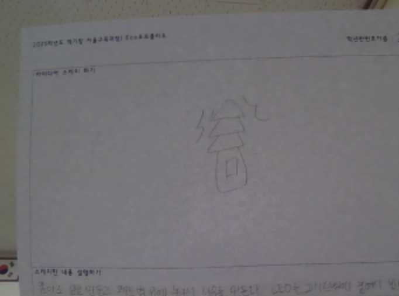

# 🌱 에코아트 프로젝트: 일회용품의 두 번째 생명

## 📖 프로젝트 개요
- **제작자**: 21120 신효담
- **제작일**: 2025-07-16
- **소개**:버려지는 플라스틱 쓰레기의 심각성을 알리고,재활용의 가능성과 희망적인 메시지를 전하기 위해 페트병 하나로 만든 빛나는 나무 작품을 제작했습니다. LED 조명은 작은 실천이 지구를 변화시킬 수 있다는 상징입니다.

## 📦 사용 재료
- 아두이노, LED
- 페트병,종이,그림 도안 등

## 🔧 제작 과정

### 1단계: 아이디어 스케치

- 아이디어 설명
  이 작품은 버려진 페트병 하나로 만든 나무이다. 나무는 생명을 상징하는 것이다. 우리가 아무 생각 없이 사용하는 일회용 플라스틱은 잠깐의 편리함을 위해 지구에 오랫동안 피해를 남긴다. 하지만 이렇게 다시 쓰면, 생명을 상징하는 존재로 바뀔 수 있다는 것을 보여주고 싶었다. 페트병 안의 LED 불빛은 환경에 대한 희망을 의미한다. 작은 실천이 모이면, 일회용품 사용을 줄이고 지구를 지키는 변화로 이어질 수 있다는 메시지를 담았다.
- 예상 완성도

### 2단계: 완성품

## 💭 제작 후기
### 느낀점
- 코딩이 처음엔 좀 어렵게 느껴졌는데 이번 활동을 통해 재미있게 느껴졌고 내가 직접 작품을 만드니 좋았다.

### 개선할 점
- 페트병 나무가 나무같지 않아서 아쉽다.

### 내가 이미 알고 있었던 것
- 플라스틱은 재활용되지 않으면 오랜 시간 동안 자연에서 분해되지 않고 환경을 오염시킨다는 사실

### 새롭게 배운게 된 것
- LED에 코딩을 적용해서 직접 불빛을 제어할 수 있다는 것

### 더 알고 싶은 것
- 진짜 환경 예술가들이 어떻게 환경 문제를 표현하고, 사람들에게 영향을 주는지

## 🌍 환경적 의미
- 이 작품이 환경에 미치는 긍정적 영향
  작은 재활용 실천이 환경 보호의 시작이 될 수 있다는 메시지를 전달한다.
- 사용한 재활용 재료가 환경에 미치는 의미
  버려지는 페트병도 다시 쓰면 자원으로서의 가치를 가질 수 있다.
- 앞으로의 환경 보호 다짐 등 자유롭게 작성하세요.
  앞으로 일회용품 사용을 줄이고 재활용을 실천하겠다.

## 📚참고 자료
- [환경 관련 웹사이트](링크)
- [참고한 에코아트 작품](링크)

## 🏷️ 태그
#에코아트 #재활용 #환경보호 #DIY #창의활동

---

> 이 프로젝트는 환경 보호와 창의적 사고를 위한 교육 목적으로 제작되었습니다.
